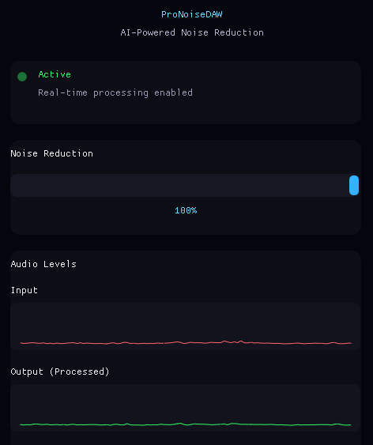

# noise-reduction-tool (ProNoiseDAW) 🎵

**noise-reduction-tool (ProNoiseDAW)** is a real-time AI-powered noise reduction tool built with RNNoise, featuring a modern GUI.
## Features

- **Real-time AI Noise Reduction** using RNNoise deep learning model
- **Live Audio Visualization** with dual waveform graphs (input/output)
- **Interactive Level Meters** showing real-time audio levels
- **Modern UI** with smooth animations and rounded corners
- **Low Latency** audio processing (10ms buffer at 48kHz)
- **Adjustable Reduction Strength** (0-100%)
- **PipeWire/PulseAudio Support** for modern Linux audio stacks

## Interface

### Main Features
- Clean, centered layout
- Animated status indicator (pulsing green dot when active)
- Real-time audio waveforms showing before/after processing
- Live level meters for instant feedback
- Red waveform: Raw input audio
- Green waveform: Processed (noise-reduced) output



## Quick Start

### Prerequisites

**Debian 13 / Ubuntu:**
```bash
sudo apt update
sudo apt install build-essential cmake git \
    libportaudio2 portaudio19-dev \
    libsdl2-dev libgl1-mesa-dev \
    pipewire pipewire-pulse wireplumber
```

**Arch Linux:**
```bash
sudo pacman -S base-devel cmake git \
    portaudio sdl2 mesa \
    pipewire pipewire-pulse wireplumber
```

### Installation

1. **Clone the repository:**
```bash
git clone https://github.com/zygim4ntas/noise-reduction-tool.git
cd noise-reduction-tool
```

2. **Build and install RNNoise:**
```bash
git clone https://github.com/xiph/rnnoise.git
cd rnnoise
./autogen.sh
./configure
make
sudo make install
sudo ldconfig
cd ..
```

3. **Download ImGui (v1.90.0 or later):**
```bash
wget https://github.com/ocornut/imgui/archive/refs/tags/v1.90.0.tar.gz
tar -xzf v1.90.0.tar.gz
cp imgui-1.90.0/*.cpp .
cp imgui-1.90.0/*.h .
cp imgui-1.90.0/backends/imgui_impl_sdl2.* .
cp imgui-1.90.0/backends/imgui_impl_opengl3.* .
```

4. **Build ProNoiseDAW:**
```bash
chmod +x build.sh
./build.sh
```

5. **Run:**
```bash
./ProNoiseDAW
```

## Usage

1. **Start PipeWire** (if not already running):
```bash
systemctl --user start pipewire pipewire-pulse
```

2. **Launch ProNoiseDAW:**
```bash
./ProNoiseDAW
```

3. **Adjust noise reduction:**
   - Use the slider to control reduction strength (0-100%)
   - Watch the waveforms to see real-time changes
   - Monitor input/output levels with the progress bars

4. **Audio flows automatically:**
   - Microphone input → ProNoiseDAW → System output
   - Use with OBS, Discord, or any audio application

## Build Script

The included `build.sh` makes compilation easy:

```bash
#!/bin/bash
g++ -o ProNoiseDAW noise-reduction-tool.cpp \
    imgui.cpp imgui_draw.cpp imgui_tables.cpp imgui_widgets.cpp \
    imgui_impl_sdl2.cpp imgui_impl_opengl3.cpp \
    -lportaudio -lrnnoise -lSDL2 -lGL -ldl -lpthread \
    -I. -I/usr/include/SDL2
```

Run with: `./build.sh && ./ProNoiseDAW`

## Troubleshooting

### Segmentation Fault on Startup

**Problem:** Application crashes immediately after "Audio stream started successfully!"

**Solutions:**

1. **Use PipeWire/PulseAudio devices (not raw ALSA):**
   - The app automatically prefers `pipewire`, `pulse`, or `default` devices
   - Avoid hardware devices like `hw:0,1` which may not support the required format

2. **Ensure PipeWire is running:**
```bash
systemctl --user status pipewire pipewire-pulse
# If not running:
systemctl --user start pipewire pipewire-pulse
```

3. **Check available devices:**
```bash
# The app prints available devices on startup
./ProNoiseDAW
# Look for "Device X: pipewire" or "Device X: default"
```

### ALSA/JACK Errors at Startup

**Problem:** Lots of "cannot connect" errors before the app starts

**Solution:** These are **normal**. PortAudio tries multiple audio backends (ALSA, JACK, OSS) before finding PipeWire. You can safely ignore these messages. The app will work if you see "Audio stream started successfully!"

### No Audio Devices Found

**Problem:** "No valid input/output devices found!"

**Solutions:**

1. **Install PipeWire utilities:**
```bash
sudo apt install pipewire-pulse pipewire-alsa
```

2. **Add user to audio group:**
```bash
sudo usermod -a -G audio $USER
# Log out and back in
```

3. **Check audio devices:**
```bash
# List audio devices
pactl list short sinks
pactl list short sources

# Or with PipeWire
pw-cli list-objects | grep -A5 "node.name"
```

### GUI Doesn't Appear

**Problem:** Application runs but no window appears

**Solutions:**

1. **Check OpenGL support:**
```bash
glxinfo | grep "OpenGL version"
# Should show version 3.3 or higher
```

2. **Install Mesa drivers:**
```bash
sudo apt install libgl1-mesa-glx libgl1-mesa-dev
```

### Audio Stuttering or Crackling

**Problem:** Audio has glitches or interruptions

**Solutions:**

1. **Increase buffer size** (edit `FRAMES_PER_BUFFER` in code):
```cpp
#define FRAMES_PER_BUFFER 960  // Try 960 or 1920
```

2. **Check CPU usage** - RNNoise is computationally intensive

3. **Use a better audio device** - Some hardware doesn't handle low latency well

### Cannot Compile - Missing Libraries

**Problem:** Compilation fails with "cannot find -lrnnoise" or similar

**Solutions:**

1. **RNNoise not installed:**
```bash
cd rnnoise
sudo make install
sudo ldconfig
```

2. **PortAudio not found:**
```bash
sudo apt install libportaudio2 portaudio19-dev
```

3. **SDL2 not found:**
```bash
sudo apt install libsdl2-dev
```

## Technical Details

### Architecture
- **Audio Backend:** PortAudio (cross-platform audio I/O)
- **Noise Reduction:** RNNoise (recurrent neural network)
- **GUI Framework:** Dear ImGui with SDL2 + OpenGL3
- **Sample Rate:** 48kHz (RNNoise requirement)
- **Buffer Size:** 480 samples (10ms latency)
- **Channels:** Mono (1 channel)

### Audio Processing Flow
```
Microphone → PortAudio → RNNoise → Mixing (strength) → Output
                ↓                       ↓
            Input Meter           Output Meter
            Input Graph           Output Graph
```

### Why These Tools?

- **RNNoise:** State-of-the-art noise suppression using deep learning
- **PortAudio:** Reliable, cross-platform audio with low latency
- **ImGui:** Immediate mode GUI - perfect for real-time visualizations
- **PipeWire:** Modern Linux audio server with low latency and compatibility

## Contributing

Contributions are welcome! Here are some ideas:

- [ ] Spectral visualization (frequency domain)
- [ ] Save/load reduction presets
- [ ] VST3 plugin version
- [ ] Windows/macOS support
- [ ] Record processed audio to file
- [ ] Multiple noise profile support
- [ ] Keyboard shortcuts

## License

This project is licensed under the MIT License - see the [LICENSE](LICENSE) file for details.

## Acknowledgments

- **RNNoise** by Xiph.Org Foundation
- **Dear ImGui** by Omar Cornut
- **PortAudio** by PortAudio community
- **SDL2** by Simple DirectMedia Layer

## Support

If you encounter issues:
1. Check [troubleshooting.md](troubleshooting.md)
2. Search existing GitHub issues
3. Open a new issue with:
   - Your Linux distribution and version
   - Console output (all error messages)
   - Steps to reproduce

